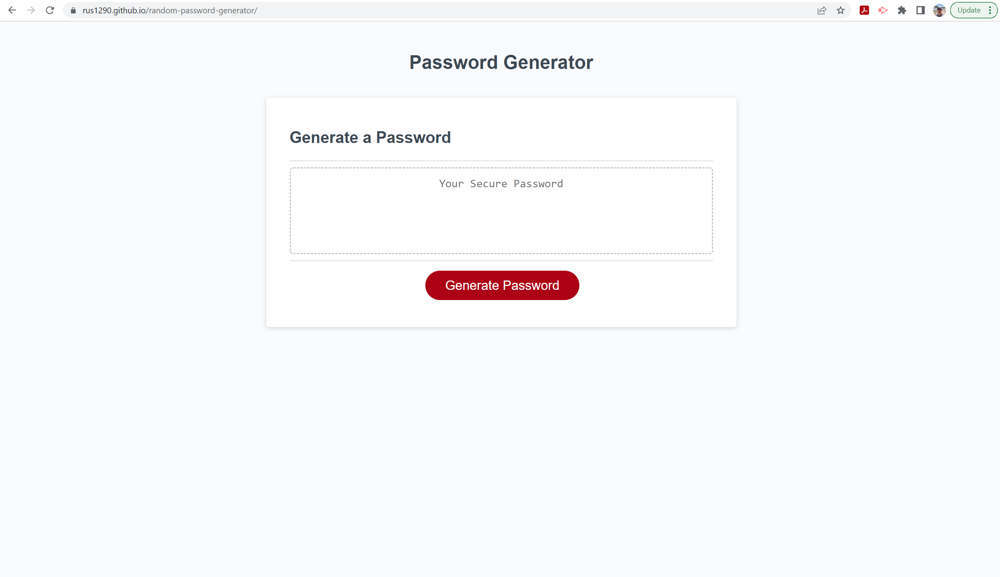

# Random Password Generator

## Application
This app creates a random password based on users user's choice. The user has an option to choose any number between 8 to 128 characters long. Also, the user will be prompted to choose charater types from a given character pool. Based on the choice of password's length and charcter types, the user will be provided with a unique password.

## Functionality

### What was Given
The file I was given, already contained complete index.html and style.css files. Also, it had script.js with some functions. It had generateBtn function, that grabbed the button with #generate, and activated function writeFuntion on click. However, script.js was missing function that would collect needed data to generate password, and then generate password itself, based on a given data.

### What was Added
To add more functionality to script.js file, I did the following:

a. Added function charLength that prompts the user to choose length of the password, and also validates the answer of a user.

b. Created function charType which prompts the user for character type and uses while loop will iterate through all character type choices and will store them in a variable choice.

c. function charDefined defined all the character types and used data from a previous function - charType var choice, to generate password, that is done in the next function.

d. function generatePassword, that I created initially, uses for loop to iterate through all the character types from a previous function - charDefined, which are saved in a variable charPool(used in writePassword) and apply Math.random method to generate random password, based on user's choices.

## Webpage Screenshot and Link to a Webpage Itself:

[WEBPAGE LINK](https://rus1290.github.io/random-password-generator/)
